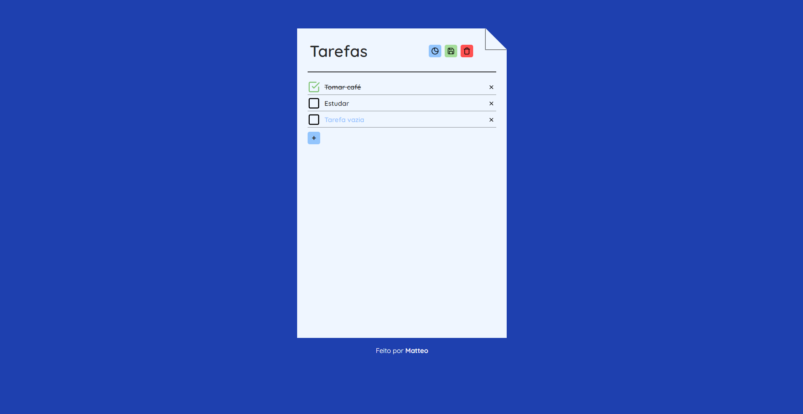

<h1 align="center"> CheckList </h1>

Página feita do zero com o foco em treinar minhas habilidades Front-end e de javascript.

  <a href="#-tecnologias">Tecnologias</a>&nbsp;&nbsp;&nbsp;|&nbsp;&nbsp;&nbsp;
  <a href="#-projeto">Projeto</a>

  

## 🚀 Tecnologias

Esse projeto foi desenvolvido com as seguintes tecnologias:

- HTML e CSS
- JavaScript
- Git e Github

## 💻 Projeto

A CheckList foi uma página feita com objetivo de treinar os conhecimentos de Front-end e JavaScript através de uma ideia simples de página para anotar suas tarefas do dia a dia.

- [Acesse o projeto finalizado, online](https://matvzn.github.io/Checklist/)
 

---
Feito por Matteo
